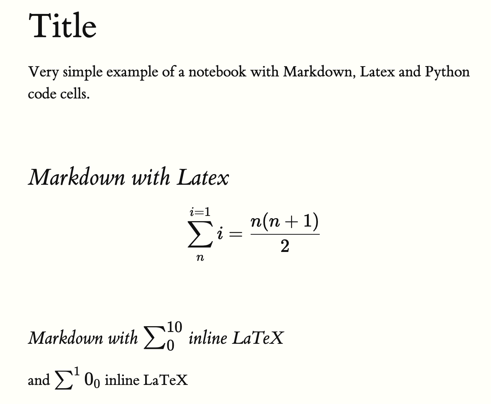

# NBH Notebook HTML

Creates a beautiful notebook HTML file from a Jupyter notebook. With ZERO dependencies. It just works.

This is a very opinionated HTML renderer for Jupyter notebooks, focusing on simplicity and readability.

It supports Markdown, LaTeX, and Python code cells, with a clean and minimal design.

Tufte CSS is used for styling, providing a clean and elegant look, Github Flavored Markdown is used for rendering Markdown cells, and KaTeX is used for rendering LaTeX equations.



## Usage

```bash
# outputs my_notebook.html in the same directory
uvx git+https://github.com/Mistobaan/nbh my_notebook.ipynb
```

```bash
# outputs my_notebook.html in the /tmp directory
uvx git+https://github.com/Mistobaan/nbh my_notebook.ipynb --output /tmp
```
